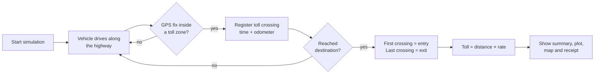
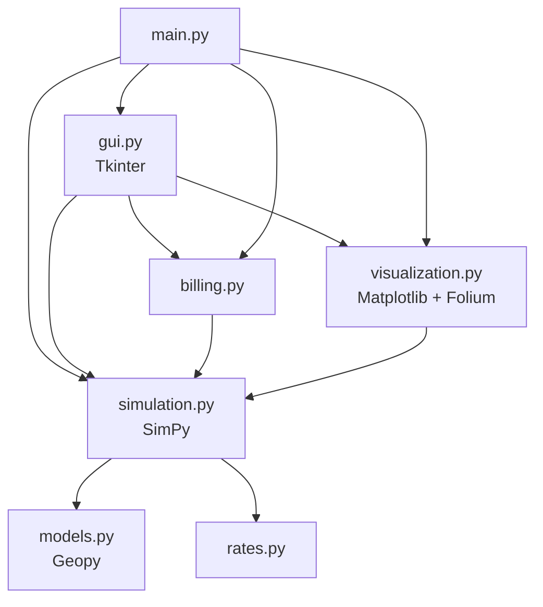

# GPS Toll-Based System Simulation


A Python simulation of **distance-based highway tolling using GPS**. Instead of paying a
fixed fee at a toll plaza, the vehicle is charged only for the distance it actually drives
on the tolled section of the highway, the way satellite (GNSS) based tolling works.

A vehicle drives from **Coimbatore to Bangalore**. Its GPS position is tracked as it
moves. Toll zones along the highway register where it enters and leaves the tolled
section, and the toll is worked out from that distance and the vehicle's per-km rate.


## Contents

- [Problem statement](#problem-statement)
- [Features](#features)
- [How it works](#how-it-works)
- [Toll rates](#toll-rates)
- [Getting started](#getting-started)
- [Usage](#usage)
- [Project structure](#project-structure)
- [Running the tests](#running-the-tests)
- [Tech stack](#tech-stack)
- [Limitations and future work](#limitations-and-future-work)
- [Presentation](#presentation)

## Problem statement

Develop a GPS toll-based system simulation using Python that:

1. Defines toll zones along a highway.
2. Registers the vehicle's start point when it passes through one toll zone and its end
   point when it passes through another.
3. Calculates the distance travelled and the toll amount.
4. Displays the vehicle's path.

## Features

- **Discrete-event simulation** of the trip with [SimPy](https://simpy.readthedocs.io/)
- **GPS geofencing**: each toll point has a circular zone (1 km radius) and the vehicle is
  detected when its GPS position falls inside it
- **Entry and exit registration** with the time and distance travelled at each toll point
- **Automatic toll calculation** using per-km rates for six vehicle classes, based on
  India's National Highways Fee Rules
- **Path plot** with the tolled section highlighted (Matplotlib)
- **Interactive map** of the trip in the browser (Folium / Leaflet)
- **Payment receipt** with a transaction ID
- **Tkinter GUI**, plus a command-line mode that runs without a display

## How it works



1. **Route.** The highway runs from Coimbatore `(11.0168, 76.9558)` to Bangalore
   `(12.9716, 77.5946)`, about 227 km in a straight line. Three toll points sit at 30%, 50%
   and 70% of the way.
2. **Driving.** The vehicle drives at a constant speed (random between 50 and 100 km/h unless
   you set one). Its GPS position is sampled at least once per simulated minute, and at
   least once per km so it can never jump over a toll zone between two samples.
3. **Detection.** The first time a GPS sample falls inside a toll zone, the crossing is
   recorded with its time and odometer reading. A zone is counted only once while the
   vehicle stays inside it.
4. **Billing.** The **first** toll zone crossed is the **entry** point and the **last** one
   is the **exit** point:

   ```
   distance charged = exit odometer − entry odometer
   toll amount      = distance charged × rate per km (for the vehicle class)
   ```

   A trip that passes fewer than two toll zones is not charged.


## Toll rates

Rates follow the structure of the
[National Highways Fee (Determination of Rates and Collection) Rules, 2008](https://indiankanoon.org/doc/162360606/).
Rule 4 sets a base rate per km for each vehicle class (2007-08 prices, highways of four or
more lanes). Rule 5 raises those rates every April by 3% a year plus 40% of the rise in the
wholesale price index. After those revisions a car pays about **₹1.50 per km**, roughly 2.3
times its base rate, and the other classes are scaled by the same factor.

| `--vehicle` | Vehicle class | Base rate 2007-08 (₹/km) | Rate used (₹/km) | Toll for 91 km |
| --- | --- | ---: | ---: | ---: |
| `car` (default) | Car / Jeep / Van | 0.65 | **1.50** | ₹136.50 |
| `lcv` | LCV / LGV / Mini bus | 1.05 | **2.42** | ₹220.22 |
| `bus` | Bus / Truck (2 axles) | 2.20 | **5.08** | ₹462.28 |
| `3axle` | 3-axle commercial vehicle | 2.40 | **5.54** | ₹504.14 |
| `mav` | Multi-axle vehicle (4-6 axles) | 3.45 | **7.96** | ₹724.36 |
| `oversized` | Oversized vehicle (7+ axles) | 4.20 | **9.69** | ₹881.79 |

The last column is the toll between Toll Point 1 and Toll Point 3 (about 91 km).

> These are representative rates for the simulation, not an official tariff. Real toll
> plazas charge different amounts depending on the section (bridges, bypasses and
> expressways cost more). The rates are defined in
> [`gps_toll/rates.py`](gps_toll/rates.py), and `--rate` overrides them for a single run.

## Getting started

### Requirements

- Python 3.9 or newer
- Tkinter for the GUI. It ships with Python on Windows and macOS. On Debian/Ubuntu run
  `sudo apt install python3-tk`. The `--cli` mode does not need it.

### Installation

```bash
git clone https://github.com/Kes2003/gps-toll-system.git
cd gps-toll-system

python -m venv .venv
source .venv/bin/activate        # Windows: .venv\Scripts\activate

pip install -r requirements.txt
```

## Usage

### GUI

```bash
python main.py
```

1. Pick the **vehicle type** from the drop-down.
2. **Start Simulation** runs a new trip and shows the summary in the window.
3. **End Simulation** shows the total toll, opens the path plot and opens the map in your
   browser (saved as `car_path_map.html`).
4. **Toll Bill** shows the payment receipt.

### Command line

```bash
python main.py --cli                          # car, random speed
python main.py --cli --vehicle bus --speed 60 # bus at 60 km/h
python main.py --cli --seed 42 --plot-file path.png
```

Example output (`python main.py --cli --speed 75`):

```
Simulation results
Route: Coimbatore -> Bangalore (227.16 km)
Vehicle: Car / Jeep / Van
Speed: 75.00 km/h, travel time: 3 h 02 min
  Passed Toll Point 1 at 68.00 km (t = 54 min)
  Passed Toll Point 2 at 113.00 km (t = 1 h 30 min)
  Passed Toll Point 3 at 159.00 km (t = 2 h 07 min)
Toll entry: Toll Point 1, exit: Toll Point 3
Distance charged: 91.00 km @ 1.50 INR/km
Total toll amount: 136.50 INR

Payment receipt
Amount Paid: 136.50 INR
Date and Time: 2026-09-25 21:19:45
Route: Coimbatore -> Bangalore
Distance Charged: 91.00 km
Rate: 1.50 INR/km
Vehicle Type: Car / Jeep / Van
Speed: 75.00 km/h
Transaction ID: 4280387012
Payment Mode: Credit Card

Map saved to /path/to/gps-toll-system/car_path_map.html
```

### Options

| Option | Description |
| --- | --- |
| `--cli` | Run without the GUI and print the results |
| `--vehicle CLASS` | Vehicle class: `car`, `lcv`, `bus`, `3axle`, `mav` or `oversized` (default: `car`) |
| `--speed KMH` | Vehicle speed in km/h (default: random between 50 and 100) |
| `--rate INR` | Override the toll rate in ₹ per km |
| `--seed N` | Random seed, for repeatable runs |
| `--map-file PATH` | Where to save the map (default: `car_path_map.html`) |
| `--plot-file PATH` | Also save the path plot as an image (CLI mode only) |
| `-v`, `--verbose` | Log every GPS fix |

`--vehicle`, `--speed`, `--rate` and `--map-file` also apply to the GUI.

### Changing the scenario

The route, toll point positions, zone radius and speed range are constants at the top of
[`gps_toll/simulation.py`](gps_toll/simulation.py). The vehicle classes and rates are in
[`gps_toll/rates.py`](gps_toll/rates.py).

## Project structure

```
gps-toll-system/
├── main.py                  # Entry point: GUI by default, --cli for terminal mode
├── gps_toll/
│   ├── models.py            # Highway, TollPoint, Car, TollCrossing, distance helper
│   ├── rates.py             # Vehicle classes and per-km toll rates
│   ├── simulation.py        # SimPy vehicle process, toll detection, TripResult
│   ├── billing.py           # Payment receipt
│   ├── visualization.py     # Matplotlib path plot and Folium map
│   └── gui.py               # Tkinter application
├── tests/                   # pytest test suite
├── docs/
│   ├── presentation.pptx    # Project presentation
│   └── screenshots/
├── requirements.txt         # Runtime dependencies
├── requirements-dev.txt     # + pytest
└── pyproject.toml           # pytest configuration
```



## Running the tests

```bash
pip install -r requirements-dev.txt
python -m pytest
```

The tests cover toll zone detection at different speeds, the toll calculation for every
vehicle class, the receipt, the plot and map output, and the command-line interface.

## Tech stack

| Purpose | Library |
| --- | --- |
| Language | Python 3.9+ |
| Discrete-event simulation | [SimPy](https://simpy.readthedocs.io/) |
| Geodesic distance | [Geopy](https://geopy.readthedocs.io/) |
| Path plot | [Matplotlib](https://matplotlib.org/) |
| Interactive map | [Folium](https://python-visualization.github.io/folium/) |
| GUI | Tkinter (standard library) |
| Tests | [pytest](https://docs.pytest.org/) |

## Limitations and future work

- The highway is a straight line between the two cities, so the distance (about 227 km) is
  shorter than the real road (about 365 km). Loading a real route, for example from
  OpenStreetMap, would make the distances realistic.
- One vehicle travels at a constant speed. The simulation could run many vehicles at once
  with varying speeds and GPS noise.
- Toll rates are representative per-km rates, not the fees of specific toll plazas.
- Trips are not stored. A database such as SQLite could keep a history of trips and receipts.

## Presentation

The project presentation (problem statement, solution, process flow, architecture and team
contributions) is in [`docs/presentation.pptx`](docs/presentation.pptx).
