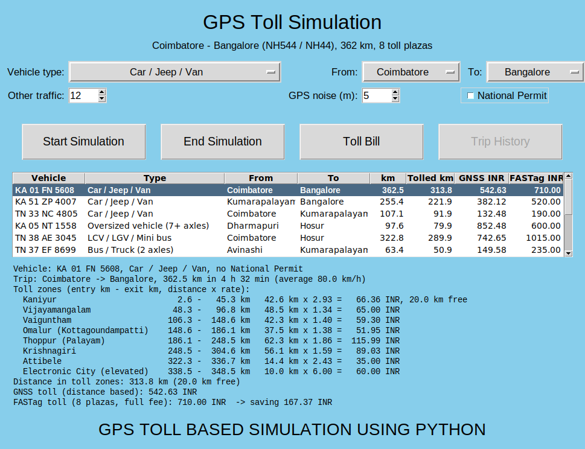
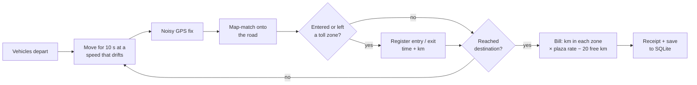
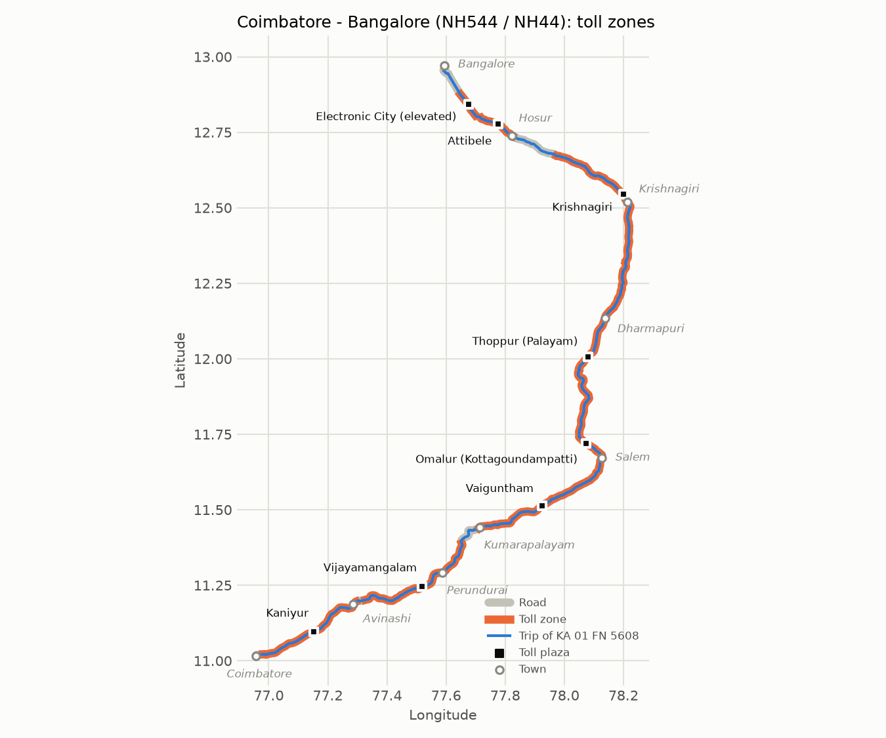
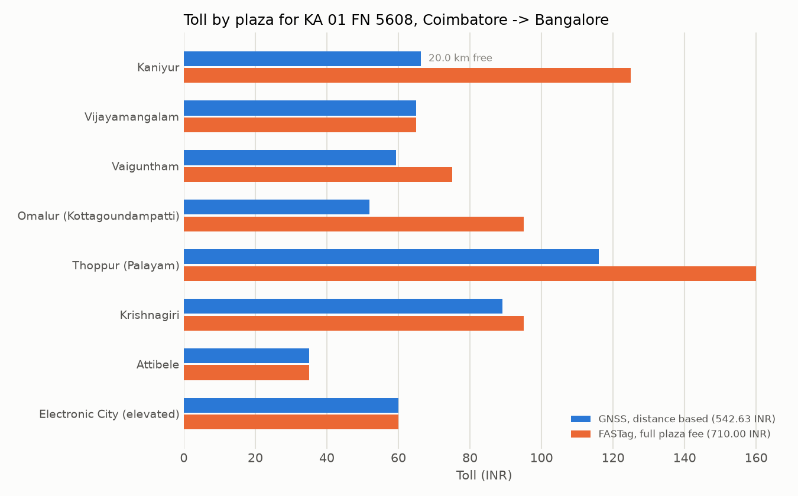
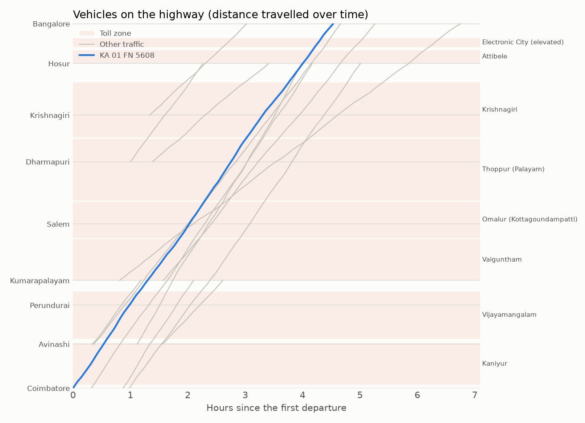
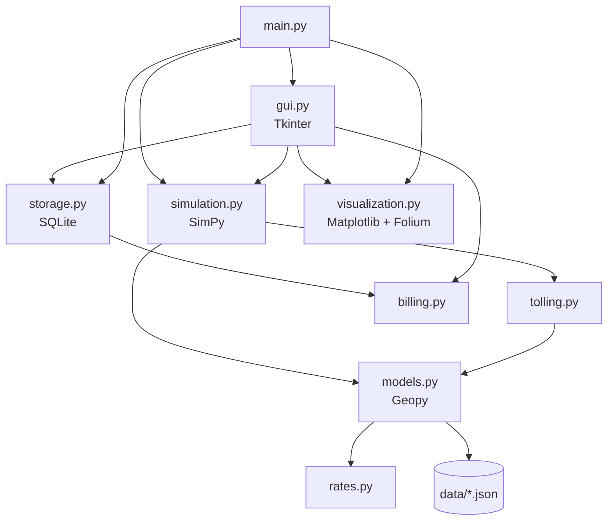

# GPS Toll-Based System Simulation


A Python simulation of **satellite (GNSS) based, distance-based highway tolling** on the
real **Coimbatore → Bangalore** highway (NH544 / NH44, 362 km).

Vehicles drive the actual road with speeds that vary over the trip. Their GPS fixes are
noisy and are map-matched back onto the road. When a vehicle enters or leaves the toll
zone of any of the **8 real toll plazas** on the way, that point is registered, and the
vehicle pays for the distance it drove in each zone at that plaza's published rate. The
result is compared with what the same trip costs at FASTag plazas today, and every trip is
saved to a SQLite history.



## Contents

- [Problem statement](#problem-statement)
- [Features](#features)
- [How it works](#how-it-works)
- [Toll plazas and fees](#toll-plazas-and-fees)
- [Getting started](#getting-started)
- [Usage](#usage)
- [Project structure](#project-structure)
- [Running the tests](#running-the-tests)
- [Tech stack](#tech-stack)
- [Limitations](#limitations)
- [Data sources and attribution](#data-sources-and-attribution)
- [Presentation](#presentation)

## Problem statement

Develop a GPS toll-based system simulation using Python that:

1. Defines toll zones along a highway.
2. Registers the vehicle's start point when it passes through one toll zone and its end
   point when it passes through another.
3. Calculates the distance travelled and the toll amount.
4. Displays the vehicle's path.

## Features

- **Real road route**: the 362 km NH544 / NH44 road from OpenStreetMap, through Salem,
  Dharmapuri, Krishnagiri and Hosur, with 9 towns where vehicles can join or leave
- **Real toll plazas**: 8 plazas at their OpenStreetMap positions, each with its published
  NHAI fee for 6 vehicle classes and the length of road that fee covers
- **GNSS tolling**: toll zone entry and exit registration, a per-km rate for each plaza, the
  20 km free daily distance, and no free distance for National Permit vehicles
- **FASTag comparison**: what the same trip costs paying the full fee at each plaza
- **Many vehicles at once**: random traffic with a realistic vehicle mix, different
  on/off towns and staggered departures, all in one [SimPy](https://simpy.readthedocs.io/)
  simulation
- **Realistic driving and GPS**: speed drifts around each vehicle's cruising speed, a GPS
  fix every 10 s with a few metres of random error, and map-matching back onto the road
- **Trip history**: every trip and its per-zone charges saved to SQLite; view it in the GUI
  or with `--history`
- **Charts and map**: route and toll zones, a time-distance diagram of all traffic, toll by
  plaza, and an interactive browser map with every vehicle's GPS track
- **Tkinter GUI**, plus a command-line mode that runs without a display

## How it works



### Route and toll zones

The route is the road geometry from OpenStreetMap: 362 km, compared with 227 km in a
straight line. Each toll plaza collects its fee for a stated length of highway (its
*tollable length*). On the route, that length becomes the plaza's **toll zone**, centred on
the plaza. Where two neighbouring zones would overlap, the overlap is split at its midpoint.



### Registering entry and exit

Every GPS fix is map-matched to a distance along the road (km from Coimbatore).

- When that distance crosses the start of a toll zone, the **entry** is registered.
- When it crosses the end, the **exit** is registered.
- A trip that starts or ends inside a zone enters or exits there.

The distance charged for the zone is `exit km − entry km`.

### Toll calculation

```
rate per km (plaza) = plaza's single-journey fee for the vehicle class / tollable length
zone charge         = km driven in the zone × rate per km
GNSS toll           = sum of zone charges, after the first 20 km are free
FASTag toll         = full single-journey fee at every plaza actually driven through
```

- **20 km free**: under the National Highways Fee Amendment Rules, 2024, vehicles without
  a National Permit pay nothing for the first 20 km a day under GNSS tolling. The free
  distance is taken from the first zones of the trip.
- **National Permit**: goods vehicles with 3 or more axles are given one by default, so
  they pay from the first km. Change it with the GUI check box or `--national-permit` /
  `--no-national-permit`.
- **Why GNSS is usually cheaper**: a FASTag plaza charges its full fee even if you only
  drive part of its section. GNSS charges only the km you drive. It can cost slightly more
  when you use a tolled stretch without passing the plaza itself (for example Dharmapuri →
  Hosur), because FASTag lets that distance go uncharged.

Full car trip, Coimbatore → Bangalore:

| Toll zone | Zone (km) | km driven | ₹/km | Charge (₹) |
| --- | --- | ---: | ---: | ---: |
| Kaniyur | 2.6 – 45.3 | 42.6 (20 free) | 2.93 | 66.36 |
| Vijayamangalam | 48.3 – 96.8 | 48.5 | 1.34 | 65.00 |
| Vaiguntham | 106.3 – 148.6 | 42.3 | 1.40 | 59.30 |
| Omalur (Kottagoundampatti) | 148.6 – 186.1 | 37.5 | 1.38 | 51.95 |
| Thoppur (Palayam) | 186.1 – 248.5 | 62.3 | 1.86 | 115.99 |
| Krishnagiri | 248.5 – 304.6 | 56.1 | 1.59 | 89.03 |
| Attibele | 322.3 – 336.7 | 14.4 | 2.43 | 35.00 |
| Electronic City (elevated) | 338.5 – 348.5 | 10.0 | 6.00 | 60.00 |
| **GNSS total** | | **313.8** | | **542.63** |
| FASTag (8 plazas × full fee) | | | | 710.00 |



### Vehicles, speed and GPS

- **Your vehicle** uses the type, towns and speed you choose. **Other traffic** is random:
  55% cars, then LCVs, buses and trucks. Each vehicle joins and leaves at random towns and
  departs within the first two hours.
- **Speed** drifts around each vehicle's cruising speed (an Ornstein–Uhlenbeck process, 10%
  standard deviation). Cars cruise at 60–100 km/h and heavy trucks at 35–65 km/h.
- **GPS**: a fix every 10 s, with normally distributed error (5 m by default). Each fix is
  snapped to the nearest point of the road near the previous position. Vehicles only drive
  forwards, so noise can't move a vehicle back.

The time-distance diagram shows every vehicle's progress. The slope of a line is its speed,
and the shaded bands are the toll zones.



## Toll plazas and fees

Single-journey fees (₹) as published on NHAI's Toll Information System. Tollable length is
the road the fee covers.

| Plaza | NH | Tollable km | Car / Jeep / Van | LCV | Bus / Truck | 3-axle | 4–6 axle | 7+ axle | Car ₹/km | Fees from |
| --- | --- | ---: | ---: | ---: | ---: | ---: | ---: | ---: | ---: | --- |
| [Kaniyur](https://www.goodreturns.in/ivrcl-chengapally-tollways-limited-kaniyur-toll-plaza-tp603.html) | NH544 | 42.6 | 125 | 195 | 400 | 605 | 605 | 785 | 2.93 | 2026-04-01 |
| [Vijayamangalam](https://www.goodreturns.in/vijayamangalam-toll-plaza-tp647.html) | NH544 | 48.5 | 65 | 115 | 235 | 375 | 375 | 375 | 1.34 | 2025-10-01 |
| [Vaiguntham](https://www.goodreturns.in/vaiguntham-toll-plaza-tp640.html) | NH544 | 53.5 | 75 | 130 | 260 | 415 | 415 | 415 | 1.40 | 2025-10-01 |
| [Omalur (Kottagoundampatti)](https://www.goodreturns.in/omalur-kottagoundapatty-toll-plaza-tp621.html) | NH44 | 68.6 | 95 | 165 | 330 | 530 | 530 | 530 | 1.38 | 2025-10-01 |
| [Thoppur (Palayam)](https://www.goodreturns.in/l-and-t-krishnagiri-thopur-palayam-toll-plaza-tp623.html) | NH44 | 86.0 | 160 | 260 | 545 | 595 | 855 | 1040 | 1.86 | 2026-08-23 |
| [Krishnagiri](https://www.goodreturns.in/krishnagiri-toll-plaza-tp609.html) | NH44 | 59.9 | 95 | 150 | 315 | 495 | 495 | 600 | 1.59 | 2026-07-10 |
| [Attibele](https://www.goodreturns.in/attibele-betl-toll-plaza-tp246.html) | NH44 | 14.4 | 35 | 60 | 120 | 250 | 250 | 250 | 2.43 | 2025-10-01 |
| [Electronic City (elevated)](https://www.goodreturns.in/elevated-section-electronic-city-toll-plaza-tp254.html) | NH44 | 10.0 | 60 | 85 | 165 | 335 | 335 | 335 | 6.00 | 2025-07-01 |

The data lives in [`gps_toll/data/toll_plazas.json`](gps_toll/data/toll_plazas.json).
Fees are revised every year, so update that file when they change.

If a plaza has no published fee for a class, the simulation falls back to a representative
rate from [`gps_toll/rates.py`](gps_toll/rates.py) (₹1.50/km for a car). That rate follows
the base rates in the
[National Highways Fee Rules, 2008](https://indiankanoon.org/doc/162360606/), revised to
current levels. `--rate` charges every zone at one flat rate instead.

## Getting started

### Requirements

- Python 3.9 or newer
- Tkinter for the GUI. It ships with Python on Windows and macOS; on Debian/Ubuntu run
  `sudo apt install python3-tk`. The `--cli` mode does not need it.

### Installation

```bash
git clone https://github.com/Kes2003/gps-toll-system.git
cd gps-toll-system

python -m venv .venv
source .venv/bin/activate        # Windows: .venv\Scripts\activate

pip install -r requirements.txt
```

The route and toll plaza data ship with the repository, so no internet connection is needed
to run the simulation. The browser map does load its map tiles online.

## Usage

### GUI

```bash
python main.py
```

1. Choose the **vehicle type**, **from** and **to** towns, the number of **other traffic**
   vehicles, the **GPS noise**, and whether the vehicle has a **National Permit**.
2. **Start Simulation** runs every vehicle at once. Results appear in the table, with your
   vehicle first and in bold.
3. Click a vehicle in the table to see its toll breakdown below.
4. **End Simulation** opens the charts (route, traffic, toll by plaza) and the map in your
   browser for the selected vehicle.
5. **Toll Bill** shows the selected vehicle's receipt.
6. **Trip History** lists all saved trips, with totals.

### Command line

```bash
python main.py --cli                                   # a car, Coimbatore -> Bangalore
python main.py --cli --vehicle bus --from Salem --to Hosur
python main.py --cli --traffic 20 --seed 42            # plus 20 other vehicles
python main.py --cli --plots-dir plots                 # also save the charts as PNGs
python main.py --history                               # the last 20 saved trips
```

Example (`python main.py --cli --speed 80 --traffic 3 --seed 21`, output shortened):

```
Simulation results
Vehicle: KA 01 FN 5608, Car / Jeep / Van, no National Permit
Trip: Coimbatore -> Bangalore, 362.5 km in 4 h 32 min (average 80.0 km/h)
Toll zones (entry km - exit km, distance x rate):
  Kaniyur                         2.6 -   45.3 km   42.6 km x 2.93 =   66.36 INR, 20.0 km free
  Vijayamangalam                 48.3 -   96.8 km   48.5 km x 1.34 =   65.00 INR
  ...
  Electronic City (elevated)    338.5 -  348.5 km   10.0 km x 6.00 =   60.00 INR
Distance in toll zones: 313.8 km (20.0 km free)
GNSS toll (distance based): 542.63 INR
FASTag toll (8 plazas, full fee): 710.00 INR  -> saving 167.37 INR

Payment receipt
Transaction ID: 3192064758
...
Amount Paid: 542.63 INR
(FASTag plaza fees would have been 710.00 INR)

All vehicles (4)
Vehicle        Type                           Route                            km      GNSS    FASTag
KA 01 FN 5608  Car / Jeep / Van               Coimbatore -> Bangalore       362.5    542.63    710.00
KA 51 ZP 4007  Car / Jeep / Van               Kumarapalayam -> Bangalore    255.4    382.13    520.00
TN 33 NC 4805  Car / Jeep / Van               Coimbatore -> Kumarapalayam   107.1    132.48    190.00
KA 05 NT 1558  Oversized vehicle (7+ axles)   Dharmapuri -> Hosur            97.6    852.54    600.00
Total                                                                       822.5   1909.78   2020.00

Saved 4 trip(s) to trips.db
Map saved to /path/to/gps-toll-system/car_path_map.html
```

### Options

| Option | Description |
| --- | --- |
| `--cli` | Run without the GUI and print the results |
| `--history [N]` | Print the last N saved trips (default 20) and exit |
| `--vehicle CLASS` | `car`, `lcv`, `bus`, `3axle`, `mav` (4–6 axles) or `oversized` (7+ axles). Default `car` |
| `--speed KMH` | Cruising speed (default: random for the vehicle class) |
| `--from PLACE`, `--to PLACE` | Coimbatore, Avinashi, Perundurai, Kumarapalayam, Salem, Dharmapuri, Krishnagiri, Hosur, Bangalore. Default Coimbatore → Bangalore |
| `--national-permit`, `--no-national-permit` | Whether the vehicle has a National Permit (default: yes for 3-axle and larger) |
| `--traffic N` | Number of other random vehicles (default 0) |
| `--gps-noise METRES` | GPS error standard deviation (default 5) |
| `--gps-interval SECONDS` | Time between GPS fixes (default 10) |
| `--speed-variation FRACTION` | How much speed varies around the cruising speed (default 0.1) |
| `--rate INR` | Charge every toll zone at this flat per-km rate |
| `--seed N` | Random seed, for repeatable runs |
| `--db PATH`, `--no-db` | Trip history database (default `trips.db`), or don't save |
| `--map-file PATH` | Where to save the map (default `car_path_map.html`) |
| `--plots-dir DIR` | Also save `route.png`, `traffic.png` and `tolls.png` (CLI mode) |
| `-v`, `--verbose` | Log every toll zone entry and exit |

All options except `--cli`, `--history` and `--plots-dir` also set the GUI's starting values.

### Trip history

Every simulated trip is saved to `trips.db`, one row per vehicle trip. It holds the vehicle,
route, distance, time, tolled and free km, GNSS and FASTag totals and the transaction ID. A
`toll_charges` table holds one row per toll zone with its entry and exit km and times, rate
and amount. View it in the GUI, with `--history`, or with any SQLite tool:

```bash
sqlite3 trips.db "SELECT registration, origin, destination, gnss_toll FROM trips ORDER BY id DESC LIMIT 5"
```

## Project structure

```
gps-toll-system/
├── main.py                    # Entry point: GUI by default, --cli, --history
├── gps_toll/
│   ├── models.py              # Route (map-matching), TollPlaza, Vehicle
│   ├── rates.py               # Vehicle classes and representative per-km rates
│   ├── tolling.py             # Toll zones, entry/exit events, GNSS bill
│   ├── simulation.py          # SimPy fleet simulation, speed and GPS models
│   ├── billing.py             # Payment receipt
│   ├── storage.py             # SQLite trip history
│   ├── visualization.py       # Matplotlib charts and Folium map
│   ├── gui.py                 # Tkinter application
│   └── data/
│       ├── route.json         # Road geometry and towns (OpenStreetMap)
│       └── toll_plazas.json   # Plaza positions, fees and tollable lengths
├── scripts/
│   └── fetch_route.py         # Re-download the route from OSRM
├── tests/                     # pytest test suite
├── docs/
│   ├── presentation.pptx      # Project presentation
│   └── screenshots/
├── requirements.txt           # Runtime dependencies
├── requirements-dev.txt       # + pytest
└── pyproject.toml             # pytest configuration
```



### Updating the route

`gps_toll/data/route.json` was downloaded from the public
[OSRM](https://project-osrm.org/) routing server, then simplified to 704 points. To
download it again:

```bash
python scripts/fetch_route.py
```

## Running the tests

```bash
pip install -r requirements-dev.txt
python -m pytest
```

The tests cover:
- map-matching and the real route and plaza data
- toll zone construction, the 20 km rule and National Permits
- entry/exit registration with and without GPS noise, partial trips, and fleets
- the receipt and the SQLite history
- the charts, the map and the command line

## Tech stack

| Purpose | Library |
| --- | --- |
| Language | Python 3.9+ |
| Discrete-event simulation | [SimPy](https://simpy.readthedocs.io/) |
| Geodesic distance | [Geopy](https://geopy.readthedocs.io/) |
| Charts | [Matplotlib](https://matplotlib.org/) |
| Interactive map | [Folium](https://python-visualization.github.io/folium/) (Leaflet) |
| Trip history | SQLite (`sqlite3`, standard library) |
| GUI | Tkinter (standard library) |
| Tests | [pytest](https://docs.pytest.org/) |

## Limitations

- Vehicles drive one way only, from Coimbatore towards Bangalore.
- Official toll section boundaries aren't in the published data. Each zone is the plaza's
  tollable length centred on the plaza, with overlaps split between neighbours.
- The 20 km free distance is applied per trip. It isn't tracked per vehicle per day across
  several trips.
- Fees are a snapshot (see the *Fees from* column). NHAI revises them every year.
- Speeds vary randomly but don't model congestion, stops or queues. GPS error is normally
  distributed, with no signal loss or multipath.

## Data sources and attribution

- Road geometry, town positions and toll booth locations: © [OpenStreetMap](https://www.openstreetmap.org/copyright)
  contributors, available under the Open Database Licence (ODbL). Route computed with
  [OSRM](https://project-osrm.org/).
- Toll plaza fees and tollable lengths: NHAI Toll Information System, via
  [goodreturns.in](https://www.goodreturns.in/toll-plaza.html) (links in the table above).
- [National Highways Fee (Determination of Rates and Collection) Rules, 2008](https://indiankanoon.org/doc/162360606/)
  and the 2024 amendment for GNSS-based tolling (zero fee for the first 20 km a day for
  non-National-Permit vehicles).

## Presentation

The project presentation (problem statement, solution, process flow, architecture and team
contributions) is in [`docs/presentation.pptx`](docs/presentation.pptx).
