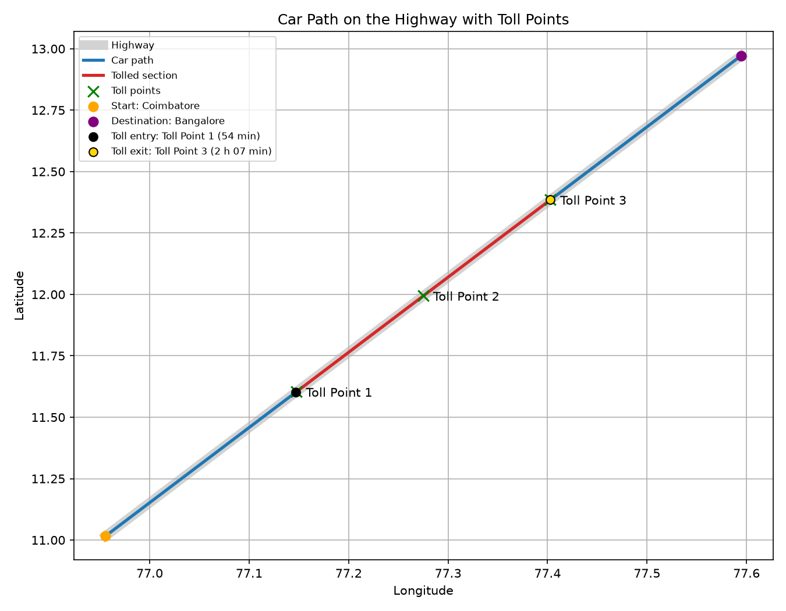

# GPS Toll-Based System Simulation

A Python simulation of distance-based highway tolling using GPS. A car drives from
**Coimbatore to Bangalore**, its GPS position is tracked as it moves, and toll zones
along the highway register where it enters and leaves the tolled section. The toll is
charged on the distance actually driven between those points.


## Features

- Discrete-event simulation of the trip with [SimPy](https://simpy.readthedocs.io/)
- GPS-style geofenced toll zones (three toll points at 30%, 50% and 70% of the route)
- Registration of the entry and exit toll points with time and distance travelled
- Automatic toll calculation (distance charged × rate per km)
- Path plot with the tolled section highlighted (Matplotlib)
- Interactive map of the trip in the browser (Folium / Leaflet)
- Payment receipt with transaction ID
- Tkinter GUI, plus a command-line mode that runs without a display

## How the toll is calculated

1. The car drives along the highway at a constant speed (random between 50 and 100 km/h
   unless you set one). Its GPS position is sampled at least once per simulated minute,
   and often enough that it can never jump over a toll zone between two samples.
2. Each toll point has a circular zone (1 km radius). The first time a GPS sample falls
   inside a zone, the crossing is recorded with its time and odometer reading.
3. The **first** zone crossed is the toll **entry** point and the **last** zone crossed is
   the toll **exit** point.
4. `toll = (exit odometer − entry odometer) × rate per km`. The default rate is
   0.25 INR/km. A trip that passes fewer than two toll zones is not charged.



## Project structure

```
gps-toll-system/
├── main.py                  # Entry point (GUI by default, --cli for terminal mode)
├── gps_toll/
│   ├── models.py            # Highway, TollPoint, Car, TollCrossing, distance helper
│   ├── simulation.py        # SimPy car process, toll detection, TripResult
│   ├── billing.py           # Payment receipt
│   ├── visualization.py     # Matplotlib path plot and Folium map
│   └── gui.py               # Tkinter application
├── tests/                   # pytest test suite
├── docs/
│   ├── presentation.pptx    # Project presentation
│   └── screenshots/
├── requirements.txt
└── requirements-dev.txt
```

## Getting started

Requires Python 3.9 or newer.

```bash
git clone https://github.com/Kes2003/gps-toll-system.git
cd gps-toll-system

python -m venv .venv
source .venv/bin/activate      # Windows: .venv\Scripts\activate

pip install -r requirements.txt
```

The GUI uses Tkinter, which ships with Python on Windows and macOS. On Debian/Ubuntu
install it with `sudo apt install python3-tk`.

## Usage

### GUI

```bash
python main.py
```

- **Start Simulation** runs a new trip and shows a summary.
- **End Simulation** shows the total toll, opens the path plot and opens the map in your browser
  (saved as `car_path_map.html`).
- **Toll Bill** shows the payment receipt.

### Command line

```bash
python main.py --cli
```

prints the trip summary and receipt and saves the map, for example:

```
Route: Coimbatore -> Bangalore (227.16 km)
Speed: 75.00 km/h, travel time: 3 h 02 min
  Passed Toll Point 1 at 68.00 km (t = 54 min)
  Passed Toll Point 2 at 113.00 km (t = 1 h 30 min)
  Passed Toll Point 3 at 159.00 km (t = 2 h 07 min)
Toll entry: Toll Point 1, exit: Toll Point 3
Distance charged: 91.00 km @ 0.25 INR/km
Total toll amount: 22.75 INR
```

### Options

| Option | Description |
| --- | --- |
| `--cli` | Run without the GUI and print the results |
| `--speed KMH` | Car speed in km/h (default: random between 50 and 100) |
| `--rate INR` | Toll rate in INR per km (default: 0.25) |
| `--seed N` | Random seed, for repeatable runs |
| `--map-file PATH` | Where to save the map (default: `car_path_map.html`) |
| `--plot-file PATH` | Also save the path plot as an image (CLI mode only) |
| `-v`, `--verbose` | Log every GPS fix |

The route, toll point positions and zone radius are defined at the top of
`gps_toll/simulation.py`.

## Running the tests

```bash
pip install -r requirements-dev.txt
python -m pytest
```

## Tech stack

- **Python** for the simulation and calculations
- **SimPy** for discrete-event simulation
- **Geopy** for geodesic distance calculation
- **Matplotlib** for path visualisation
- **Folium** for the interactive map
- **Tkinter** for the GUI

## Presentation

The project presentation (problem statement, process flow, architecture and team
contributions) is in [`docs/presentation.pptx`](docs/presentation.pptx).
